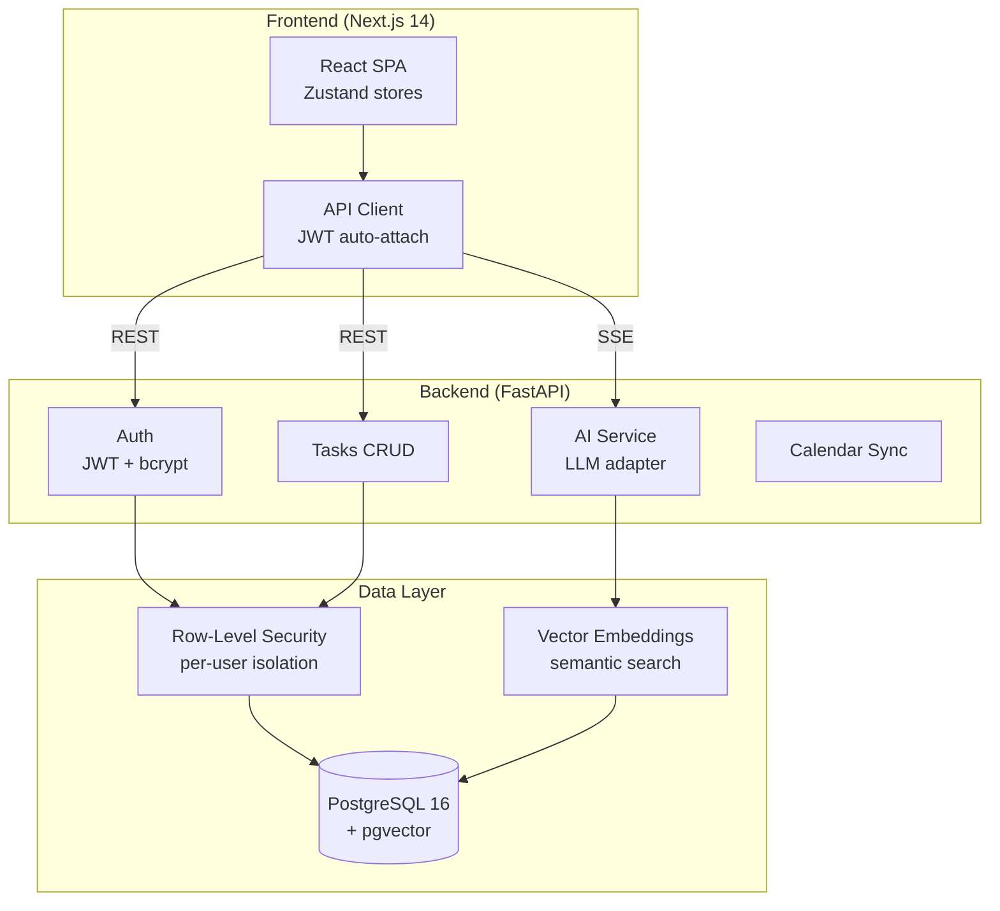
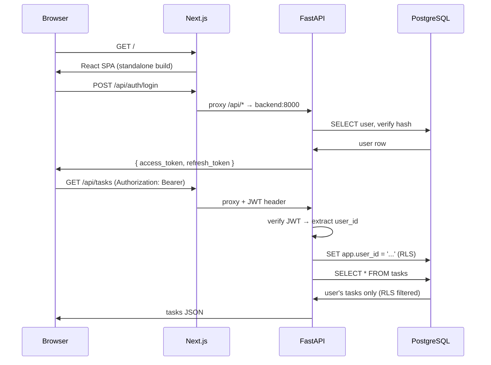

# Prysm Note 🔮

AI-powered task management with a 3-pane interface (sidebar, timeline, AI chat). Built as a folder-based monorepo.

## Quick Start

### Option 1: Docker (recommended)

```bash
cp .env.example .env
# Edit .env with your secrets
docker-compose up
```

### Option 2: Local Development

**Prerequisites:** Node.js 20+, Python 3.11+, PostgreSQL 16 with pgvector

```bash
# 1. Setup
npm run setup

# 2. Launch
npm run launch
```

### Option 3: Manual

**Backend:**
```bash
cd apps/backend
pip install -e .
uvicorn app.main:app --reload --port 8000
```

**Frontend:**
```bash
cd apps/frontend
npm install
npm run dev
```

Open http://localhost:3000

## Features

### Core
- **3-Pane UI**: Sidebar navigation | Timeline view | AI chat assistant
- **Task Management**: Full CRUD with drag-and-drop rescheduling
- **Timeline**: Gantt-style horizontal timeline with per-project lanes

### AI Assistant
- Multi-intent parsing ("Create a meeting next Thursday, recurring every 2 weeks")
- Smart deduplication checks before creating tasks
- Contextual subtask suggestions ("Break this down" button on broad tasks)
- Schedule conflict detection
- Cross-referencing and linking tasks across projects
- Provider routing: OpenAI, Google Gemini, DeepSeek
- Semantic search via pgvector embeddings

### Security
- JWT authentication (15-min access + 7-day refresh tokens)
- Row-Level Security (RLS) on all database tables
- API keys encrypted at rest (Fernet)
- Rate limiting on auth endpoints
- IP blocklist after 10 failed login attempts
- Input validation on all endpoints

### Themes
10 built-in themes + full customization:
- **Dark** (default) — Deep space purple
- **Light** — Lavender light mode
- **Dracula** — Purple/green accents
- **Nord** — Arctic blues
- **Monokai** — Yellow/green accents
- **Slate Pro** — Cool blue, professional
- **Coffee Roast** — Warm browns
- **Solarized Dark** — Teal/blue accent
- **GitHub Dark** — GitHub's exact dark palette
- **Tokyonight** — Neon blue/purple
- **Custom Theme** — Create your own with 16 color token editor
- **Font Customization** — Choose from 10 presets or type any Google Font
- **Background Images** — Upload images or use built-in patterns/gradients

See the [Developer Theming Guide](#-developer-theming-guide) below for details.

### Google Calendar Sync
- OAuth 2.0 integration
- Two-way sync (push tasks to calendar, pull events)
- Token storage with auto-refresh

## Environment Variables

Key variables in `.env`:

| Variable | Required | Description |
|----------|----------|-------------|
| `DATABASE_URL` | Yes | PostgreSQL connection string |
| `JWT_SECRET_KEY` | Yes | 64-char random string for JWT |
| `ENCRYPTION_KEY` | Yes | 44-char Fernet key for API key encryption |
| `GOOGLE_CLIENT_ID` | No | Google Calendar OAuth |
| `GOOGLE_CLIENT_SECRET` | No | Google Calendar OAuth |
| `NEXT_PUBLIC_API_URL` | No | API URL (default: http://localhost:8000/api) |

Generate keys:
```bash
python -c "import secrets; print(secrets.token_hex(32))"
python -c "from cryptography.fernet import Fernet; print(Fernet.generate_key().decode())"
```

## Architecture

```
prysm-note/
├── apps/
│   ├── frontend/        # Next.js 14 App Router + Tailwind CSS
│   └── backend/         # FastAPI + SQLAlchemy (async) + PostgreSQL/pgvector
├── docker/              # Dockerfiles + DB init scripts
├── scripts/             # Launch & setup scripts
├── docker-compose.yml
└── turbo.json
```

### Database (11+ tables)
- users, projects, tasks, tags, task_tags, task_links
- api_keys (encrypted), task_embeddings (pgvector), ai_conversations
- calendar_events, user_tokens (OAuth storage)

All tables have RLS policies keyed on `app.user_id` session variable.

### LLM Adapter Pattern
All providers implement `LLMClient` ABC in `app/llm/base.py`. Register with `@register_provider(name)`.

## API Overview

| Endpoint | Description |
|----------|-------------|
| `POST /api/auth/register` | Create account |
| `POST /api/auth/login` | Sign in |
| `POST /api/auth/refresh` | Refresh JWT |
| `GET/POST/PATCH/DELETE /api/tasks` | Task CRUD |
| `GET/POST /api/tasks/{id}/subtasks` | Subtask management |
| `POST /api/tasks/expand-recurring` | Expand recurring tasks |
| `GET /api/projects` | List projects |
| `GET/POST/DELETE /api/tags` | Tag management |
| `POST/DELETE /api/tags/tasks/{id}` | Task-tag associations |
| `GET/POST/DELETE /api/task-links` | Task link management |
| `GET /api/search/?q=&mode=semantic` | Search with vector mode |
| `POST /api/ai/chat` | AI chat (non-streaming) |
| `POST /api/ai/chat/stream` | AI chat (SSE streaming) |
| `GET /api/ai/sessions` | List AI chat sessions |
| `POST /api/keys` | Save API key (encrypted) |
| `POST /api/calendar/sync` | Sync with Google Calendar |

## Common Commands

```bash
npm run dev       # Start frontend dev server
npm run build     # Build frontend
npm run setup     # One-time environment setup
npm run launch    # Build + start both frontend & backend
docker-compose up # Full stack with Docker
```

## Tech Stack

| Layer | Technology |
|-------|-----------|
| Frontend | Next.js 15, React 18, TypeScript, Tailwind CSS, Zustand, @dnd-kit |
| Backend | FastAPI, SQLAlchemy 2 (async), Pydantic v2, Alembic |
| Database | PostgreSQL 16, pgvector |
| AI/LLM | OpenAI, Google Gemini, DeepSeek (adapter pattern) |
| Auth | JWT (python-jose), bcrypt |
| Calendar | Google Calendar API |
| Infrastructure | Docker, Docker Compose, Turborepo |

## 🎨 Developer Theming Guide

Prysm Note uses a **design token JSON system** as the single source of truth for all visual properties. Everything — colors, themes, fonts, backgrounds, radii, and shadows — is defined in one file and flows down to CSS custom properties, Tailwind config, and the React theme provider.

### File Structure

```
apps/frontend/src/
├── design-tokens.json          ← Single source of truth for ALL themes and presets
├── types/theme.ts              ← TypeScript interfaces + re-exports from tokens JSON
├── lib/theme-context.tsx       ← React context: applies tokens to CSS vars at runtime
├── lib/dynamic-font-loader.tsx ← Loads Google Fonts dynamically based on user selection
├── app/globals.css             ← CSS fallback [data-theme] blocks + body::before for BGs
└── tailwind.config.ts          ← References CSS vars for colors/fonts/radii/shadows
```

### Architecture Flow

```
design-tokens.json
    │
    ├──→ types/theme.ts (TypeScript types + re-exports)
    ├──→ theme-context.tsx (applyTheme() sets CSS vars on :root)
    │     │
    │     └──→ CSS Custom Properties (--bg-base, --accent, etc.)
    │           │
    │           ├──→ tailwind.config.ts (Tailwind classes reference vars)
    │           └──→ globals.css (all components use CSS vars directly)
    │
    └──→ DynamicFontLoader (injects <link> for selected font)
```

### How to Add a New Theme

1. **Add to `design-tokens.json`** under `themes`:
   ```json
   "my-theme": {
     "label": "My Theme",
     "colors": {
       "base": "#1a1a1a",
       "surface": "#222222",
       ...
     }
   }
   ```

2. **Add to `types/theme.ts`** — add `"my-theme"` to the `ThemeName` union type.

3. **Add CSS fallback** in `globals.css`:
   ```css
   [data-theme="my-theme"] {
     --bg-base: #1a1a1a;
     --bg-surface: #222222;
     --text-primary: #ffffff;
     ...
     color-scheme: dark;
   }
   ```
   The CSS fallback ensures instant rendering before JavaScript loads.

4. Done — the new theme appears automatically in the Appearance settings grid.

### How to Add Font Presets

Add to `design-tokens.json` → `fontPresets` array:
```json
"fontPresets": ["Inter", "JetBrains Mono", ..., "My Font"]
```
The new font appears in the dropdown automatically. Google Fonts are loaded dynamically — the font name must be available on Google Fonts.

### How to Add Background Presets

Add to `design-tokens.json` → `backgroundPresets` array:
```json
{ "id": "waves", "label": "Waves", "type": "gradient", "value": "linear-gradient(...)" }
```

Types:
- `"gradient"` — CSS gradient value, rendered with `background-size: cover`
- `"pattern"` — repeating pattern, specify `"size"` field (e.g. `"24px 24px"`)
- `"none"` — no background

### How to Change Radii / Border Widths / Spacing

Edit `globals.css` `:root` block:
```css
:root {
  --radius-sm: 10px;
  --radius-md: 14px;
  --radius-lg: 20px;
  --radius-xl: 28px;
}
```

Then update `tailwind.config.ts` if you add new radius tokens.

### How to Add New CSS Custom Properties

1. Add to `design-tokens.json` theme color objects
2. Add the property to `ThemeColors` interface in `types/theme.ts`
3. Apply it in `applyThemeColors()` in `theme-context.tsx`
4. Add it to `tailwind.config.ts` under `colors`
5. Add it to the CSS `[data-theme]` fallback blocks in `globals.css`

### User Customization Features

All user customizations are stored in `localStorage` and persist across sessions:

| Feature | Storage Key | Description |
|---------|-------------|-------------|
| Theme | `prysm-theme` | Selected theme name (dark, light, etc.) |
| Custom Theme | `prysm-custom-theme` | User-created theme (all 16 color tokens) |
| Font | `prysm-font` | Font family name (from presets or custom) |
| Background | `prysm-bg` | Background preset or image data URL |
| Background Image | `prysm-bg-image` | Uploaded image as base64 data URL |

### How to Override Any CSS Globally

Edit `globals.css` in the `@layer components` section. All components use the CSS custom properties listed above — changing one value propagates everywhere.

To add component-specific overrides:
```css
.card { border-radius: var(--radius-sm); }
.sidebar-item { font-size: 13px; }
```

## Architecture Overview



### Component Tree

```
ThreePaneLayout
├── SidebarLeft
│   ├── NavSection (Inbox, Today, Next 7 Days)
│   ├── FilterBar (status/project filters)
│   ├── TagList
│   └── ThemeSelector
├── TimelineView
│   ├── TimelineHeader (search, view switcher, +New)
│   └── TimelineGrid (infinite horizontal scroll)
│       └── TaskBar (drag-and-drop, resize)
└── ChatPanel
    ├── ChatMessage
    └── ChatInput
```

### Request Lifecycle



## Contributing

### Development Setup

```bash
cp .env.example .env
docker compose up
# Open http://localhost:3000
```

### Code Conventions

- **Frontend**: TypeScript strict, Tailwind CSS utility classes, Zustand for state
- **Backend**: Python 3.12+, type hints, async/await, Pydantic v2 schemas
- **Commits**: Conventional Commits (`feat:`, `fix:`, `chore:`)
- **Tests**: Vitest (frontend) + pytest (backend) required before merge
- **Icons**: Hand-coded inline SVGs — no icon libraries
- **Sounds**: Web Audio API synthesis — no audio files

### Before Submitting Changes

```bash
npm run build                    # Must compile
npm test                         # Frontend tests
cd apps/backend && pytest -v     # Backend tests
npm run smoke:api                # API smoke check
npm run smoke:ui                 # UI smoke check
```

### License

Community Edition: AGPL-3.0. See [LICENSE](LICENSE) for details.


